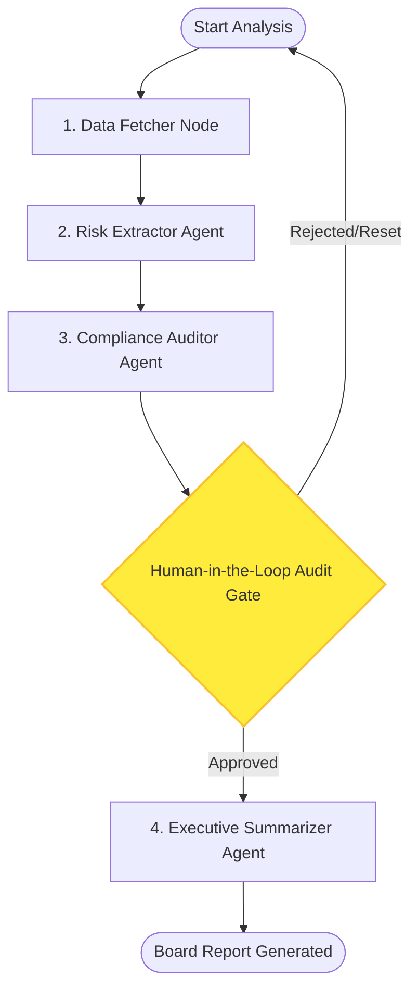

# SEC 10-K Autonomous Risk Analyzer (aria-10k)

An enterprise-grade **Multi-Agent System (MAS)** designed for the financial sector to automate the corporate due diligence process. The system retrieves public financial reports (SEC Form 10-K), extracts and parses risk factors via Retrieval-Augmented Generation (RAG), audits them against investment compliance guidelines, and drafts structured executive board reports.

It is implemented using **LangChain**, **LangGraph**, and **Streamlit**, with full support for both **100% local operation** (Ollama + ChromaDB) and **cloud deployment** (OpenAI/Anthropic + Pinecone), and features built-in **LangSmith** observability and evaluations.

---

## 1. Executive Vision ("Outcomes over Noise")

Traditional risk auditing of SEC 10-K filings is a manual, labor-intensive process that can take up to three weeks per company. **aria-10k** reduces this cycle to minutes while maintaining mathematical control over hallucinations, strict data privacy, and a human-governed decision gate.

* **Commercial Objective**: Accelerate risk due diligence workflows while maintaining institutional liability control via a Human-in-the-Loop approval gate.
* **Accuracy Assurance**: Auto-evaluated through a LangSmith validation suite enforcing a minimum RAG faithfulness rating of $\ge 85\%$.

---

## 2. System Architecture

The core of the system is built on an **Assembly Line / Sequential Pipeline** pattern modeled as a stateful graph using LangGraph.

### Pipeline Flow Graph



### Key Components

1. **[src/ingestion.py](file:///Users/johan/Development/aria-10k/src/ingestion.py)**:
   * Connects to the SEC EDGAR API to programmatically download the latest 10-K filings.
   * Parses HTML/text inputs to isolate **Item 1A (Risk Factors)** to prevent context contamination.
   * Leverages `RecursiveCharacterTextSplitter` and `HuggingFaceEmbeddings` (`all-MiniLM-L6-v2`) to chunk and index documents into either ChromaDB (local) or Pinecone (cloud).
   * Validates stock tickers against SEC EDGAR with local fallback for S&P 500 tech companies.
2. **[src/agents.py](file:///Users/johan/Development/aria-10k/src/agents.py)**:
   * **Risk Extractor Agent**: Extracts exactly the top 5 most critical financial, operational, or legal risks from the vector database using RAG.
   * **Compliance Auditor Agent**: Audits the 5 extracted risks against investment fund policies (litigation exposure, supply chain concentration, foreign currency fluctuations) and issues compliance verdicts.
   * **Executive Summarizer Agent**: Consolidates the audited risks and compliance comments into a board-ready Markdown report.
3. **[src/graph.py](file:///Users/johan/Development/aria-10k/src/graph.py)**:
   * Combines nodes into a LangGraph `StateGraph` using `MemorySaver` to persist conversation state across checkpoints.
   * Enforces a mandatory breakpoint before the executive summarizer node (`interrupt_before=["executive_summarizer"]`) to facilitate Human-in-the-Loop verification.
4. **[app.py](file:///Users/johan/Development/aria-10k/app.py)**:
   * Interactive Streamlit dashboard.
   * Displays agent progress in real time.
   * Implements the Human-in-the-Loop review panel, allowing analysts to audit verdicts, approve and compile reports, or reject and reset runs.
   * Includes legal disclaimer banners and markdown downloads.

---

## 3. Repository Structure

```
aria-10k/
├── .agents/                      # Agent Infrastructure & Progress Logs
│   ├── harness/                  # Dev setup, progress files, and lifecycle prompts
│   │   ├── aria-10k-progress.md  # Progress handoff log
│   │   └── feature_list.json     # Feature roadmap checklist
│   └── memory/                   # Contextual and architectural decision logs
│       ├── architecture-decisions.md
│       └── shared-context.md
├── src/                          # Application Source Code
│   ├── __init__.py
│   ├── agents.py                 # Multi-agent prompt templates and factory
│   ├── evals.py                  # LangSmith RAG faithfulness evaluation suite
│   ├── graph.py                  # LangGraph Workflow and state definition
│   ├── ingestion.py              # SEC data ingestion, parser, and Vector DB setup
│   └── tests/                    # Comprehensive test suite
│       ├── test_agents.py
│       ├── test_app.py
│       ├── test_evals.py
│       ├── test_graph.py
│       ├── test_ingestion.py
│       └── test_state.py
├── data/                         # Temporary download folder for SEC documents (gitignored)
├── vector_store/                 # Persistent local Chroma database directories (gitignored)
├── .env.example                  # Environment configuration template
├── requirements.txt              # Project dependencies list
├── spec.md                       # Technical product specification
├── app.py                        # Streamlit UI dashboard
└── README.md                     # Project documentation
```

---

## 4. Setup & Installation

### Prerequisites

* Python 3.9+ installed.
* (Optional) [Ollama](https://ollama.com/) running locally for local LLM inference.

### Installation Steps

1. **Clone the Repository**:
   ```bash
   cd aria-10k
   ```

2. **Create and Activate Virtual Environment**:
   ```bash
   python3 -m venv .venv
   source .venv/bin/env
   ```

3. **Install Dependencies**:
   ```bash
   pip install -r requirements.txt
   ```

4. **Configure Environment Variables**:
   Copy the [.env.example](file:///Users/johan/Development/aria-10k/.env.example) file to `.env` and fill out your keys:
   ```bash
   cp .env.example .env
   ```

   **Key Config Options**:
   * `USE_LOCAL_LLM`: Set `true` to use Ollama (local) or `false` to use OpenAI/Anthropic (cloud).
   * `USE_LOCAL_VECTORDB`: Set `true` to use ChromaDB (local) or `false` to use Pinecone (cloud).
   * `SEC_API_USER_AGENT`: **Strictly required** by the SEC EDGAR API. Format: `YourName YourEmail@domain.com`.
   * `LOCAL_LLM_MODEL`: Ollama model name (e.g., `llama3` or `mistral`).
   * `OPENAI_API_KEY` / `ANTHROPIC_API_KEY`: API keys for cloud LLM mode.
   * `LANGSMITH_API_KEY`: Required for tracking traces and evaluations.

---

## 5. Running the Application

### 1. Local Mode Preparation (Ollama)
Ensure Ollama is running and the desired model is pulled:
```bash
ollama run llama3
```

### 2. Launching the Streamlit Web Interface
Run the app via:
```bash
streamlit run app.py
```
Open your browser and navigate to the local server URL (usually `http://localhost:8501`).

1. Select your execution mode (Local vs. Cloud) in the sidebar.
2. Enter a stock ticker symbol (e.g., `AAPL`, `TSLA`, `MSFT`).
3. Press **Start Analysis** to launch the LangGraph workflow.
4. Review the extracted risk list under the **Human-in-the-Loop Gate** section.
5. Click **Approve** to generate the board report, or **Reject** to abort.

---

## 6. Observability & Evaluations

**aria-10k** integrates with **LangSmith** to monitor LLM invocations and evaluate faithfulness.

### RAG Faithfulness Evaluations
The evaluation suite evaluates how well the generated responses match the extracted context without introducing hallucinations.

* To create the evaluation dataset and execute the faithfulness run:
  ```python
  from src.evals import run_faithfulness_eval
  run_faithfulness_eval()
  ```
* Evaluators run locally or in the cloud depending on your environment flags.
* A minimum score of **0.85** is required. If the LLM judge rates the run below this threshold, a `ValueError` will be thrown, marking the pipeline run as invalid.

---

## 7. Running Tests

The project includes unit and integration tests covering data ingestion, parsing, LLM nodes, graph compilation, and state transition states. 

To run tests, make sure to set the `PYTHONPATH` correctly:
```bash
PYTHONPATH=. .venv/bin/pytest
```

---

## 8. Legal Disclaimer

> **⚠️ WARNING**: Financial analysis generated by this application is for informational purposes only. It is not financial, legal, or investment advice. SEC Form 10-K parsing is automated and should be verified against official filings on [SEC EDGAR](https://www.sec.gov/edgar/searchedgar/companysearch).
